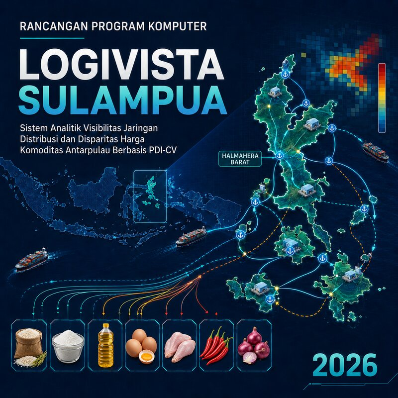
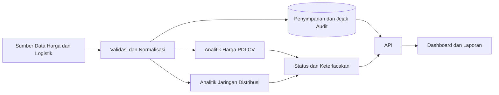

# LOGIVISTA SULAMPUA

**Sistem Analitik Visibilitas Jaringan Distribusi dan Disparitas Harga Komoditas Antarpulau Berbasis PDI-CV**



LOGIVISTA SULAMPUA adalah implementasi referensi program komputer untuk memvalidasi data harga, menghitung disparitas antawilayah, membaca struktur jaringan distribusi, dan menyajikan hasil analitik yang dapat ditelusuri. Cakupan implementasi awal adalah **Kabupaten Halmahera Barat**.

> Nama “SULAMPUA” menunjukkan arah pengembangan ke Sulawesi, Maluku, dan Papua. Versi `0.1.0` tidak menyatakan bahwa sistem telah beroperasi atau tervalidasi di seluruh wilayah tersebut.

## Status implementasi

- Versi: `0.1.0`
- Status: prototipe referensi untuk draf Hak Cipta Program Komputer
- Wilayah awal: Kabupaten Halmahera Barat
- Data bawaan: sintetis dan anonim
- PDI: formula operasional usulan v0.1 yang masih memerlukan ratifikasi
- Integrasi sumber data pemerintah: belum disertakan karena memerlukan izin, kredensial, dan verifikasi skema

Repositori ini menyediakan kode yang dapat dijalankan dan diuji. Repositori tidak memuat klaim hasil lapangan, tingkat akurasi kebijakan, atau integrasi produksi yang belum dibuktikan.

## Fungsi utama

- Validasi observasi harga berdasarkan sumber, tanggal, wilayah, komoditas, satuan, dan nilai harga.
- Agregasi harga rata-rata per wilayah untuk mencegah pembobotan wilayah yang tidak seimbang.
- Perhitungan koefisien variasi populasi atau CV.
- Perhitungan `PDI v0.1 = (harga maksimum − minimum) / rata-rata × 100%`.
- Analisis tren awal-akhir periode dan keterlacakan sumber.
- Analisis jaringan distribusi terarah: simpul, rute, derajat masuk-keluar, komponen, frekuensi, dan lead time.
- Identifikasi simpul berkonektivitas rendah dan rute berfrekuensi rendah sebagai tanda tinjauan, bukan keputusan otomatis.
- REST API, dashboard web, penyimpanan audit SQLite, contoh data, dan unit test.

## Komoditas prioritas versi awal

1. Beras medium
2. Gula pasir
3. Minyak goreng
4. Telur ayam ras
5. Daging ayam ras
6. Cabai
7. Bawang merah

## Arsitektur



## Struktur repositori

```text
LOGIVISTA-SULAMPUA/
├── backend/
│   ├── app/
│   │   ├── analytics.py
│   │   ├── config.py
│   │   ├── csv_loader.py
│   │   ├── database.py
│   │   ├── main.py
│   │   ├── models.py
│   │   └── network.py
│   └── tests/
├── frontend/
│   ├── app.js
│   ├── index.html
│   └── styles.css
├── samples/
├── docs/
├── .github/workflows/ci.yml
├── Dockerfile
├── docker-compose.yml
└── requirements.txt
```

## Menjalankan secara lokal

### 1. Persyaratan

- Python 3.11 atau lebih baru
- `pip`

### 2. Buat lingkungan virtual

```bash
python -m venv .venv
```

Windows:

```bash
.venv\Scripts\activate
```

Linux atau macOS:

```bash
source .venv/bin/activate
```

### 3. Instal dependensi

```bash
pip install -r requirements.txt
```

### 4. Jalankan API

```bash
uvicorn backend.app.main:app --reload
```

API tersedia di `http://127.0.0.1:8000`. Dokumentasi interaktif tersedia di `http://127.0.0.1:8000/docs`.

### 5. Jalankan dashboard

Buka terminal lain.

```bash
python -m http.server 5500 --directory frontend
```

Buka `http://127.0.0.1:5500`.

## Menjalankan dengan Docker Compose

```bash
docker compose up --build
```

- API: `http://127.0.0.1:8000`
- Dashboard: `http://127.0.0.1:5500`

## Contoh penggunaan API

Analisis harga:

```bash
curl -X POST http://127.0.0.1:8000/api/v1/analysis/prices \
  -H "Content-Type: application/json" \
  -d @samples/price-analysis.json
```

Analisis jaringan:

```bash
curl -X POST http://127.0.0.1:8000/api/v1/analysis/network \
  -H "Content-Type: application/json" \
  -d @samples/network-analysis.json
```

Nilai `persist` pada berkas contoh adalah `false`. Ubah menjadi `true` hanya jika hasil dan observasi memang boleh disimpan ke SQLite.

## Pengujian

```bash
python -m unittest discover -s backend/tests -v
```

Pengujian mencakup formula CV dan PDI v0.1, agregasi wilayah, validasi data, analisis konektivitas, impor CSV, serta jejak audit SQLite.

## Definisi metodologi versi 0.1

### Koefisien variasi

Implementasi memakai simpangan baku populasi karena himpunan harga rata-rata wilayah diperlakukan sebagai seluruh wilayah yang dimasukkan ke satu proses analisis, bukan sampel statistik dari populasi yang lebih luas.

```text
CV = simpangan baku populasi harga rata-rata wilayah / rata-rata harga wilayah × 100%
```

### PDI v0.1

```text
PDI v0.1 = (harga rata-rata wilayah maksimum − minimum) / rata-rata harga wilayah × 100%
```

Formula tersebut adalah definisi operasional pada draf. Istilah `PDI v0.1` sengaja dipertahankan agar tidak disalahartikan sebagai indeks baku universal.

### Ambang peringatan

Nilai bawaan CV `10%` dan PDI `15%` hanya konfigurasi ilustratif untuk menguji alur program. Penetapan ambang operasional wajib didasarkan pada validasi data historis, telaah pakar, kebijakan instansi, serta uji sensitivitas.

## Tata kelola data

- Jangan memasukkan kredensial, data pribadi, atau koordinat sensitif ke repositori publik.
- Simpan identitas sumber, periode, satuan, dan batas metodologi bersama hasil analisis.
- Gunakan data agregat atau anonim untuk demonstrasi.
- Pastikan izin dan ketentuan penggunaan sumber data sebelum integrasi produksi.
- Tinjau kualitas dan konsistensi satuan sebelum membandingkan harga.

## Batas penggunaan

LOGIVISTA SULAMPUA adalah alat bantu analitik. Hasil tidak otomatis membuktikan sebab disparitas, menentukan rute optimal, atau menjadi keputusan kebijakan. Interpretasi operasional memerlukan verifikasi sumber, konteks rantai pasok, gangguan transportasi, struktur pasar, dan penilaian ahli logistik.

## Pencipta dan pemegang hak

Pencipta:

- Miftahol Arifin
- Famila Dwi Winati
- Rui Almer

Pemegang Hak Cipta: **Telkom University**.

## Hak penggunaan

Hak cipta dilindungi. Lihat [LICENSE](LICENSE). Publikasi kode di GitHub tidak otomatis memberikan izin untuk menyalin, mengubah, mendistribusikan, atau menggunakan program secara komersial.
